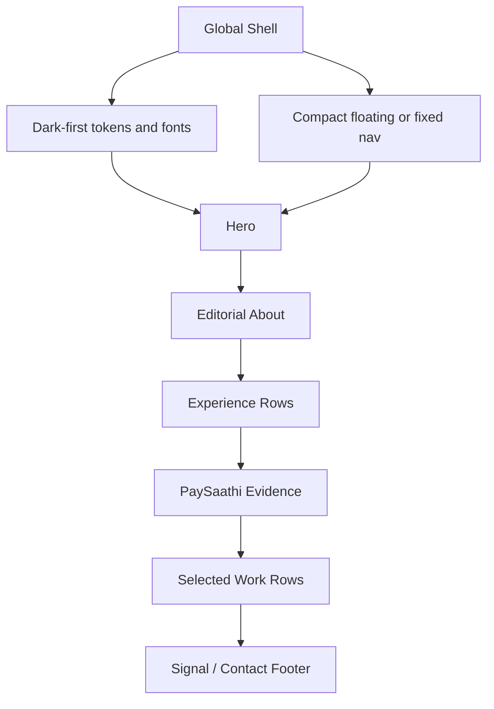

# Thirumalai-Style UI Refresh - Plan

## Goal Capsule

| Field | Value |
|---|---|
| Objective | Rework the current portfolio UI into a quieter, editorial, Thirumalai-inspired single page while preserving the existing content and data model. |
| Authority | User request and confirmed scoping synthesis outrank the earlier broad rebuild plan. Existing portfolio data is the content source unless a unit explicitly revises copy. |
| Execution profile | UI-focused Next.js/Tailwind implementation with smoke-first browser verification. |
| Stop conditions | Stop if the requested reference direction conflicts with factual portfolio content, if a required visual asset is unavailable, or if browser verification shows unreadable or overlapping content. |
| Tail ownership | The implementer finishes by running repo verification and inspecting desktop and mobile viewports. |

---

## Product Contract

### Summary

This plan refreshes the existing portfolio toward the visual language of `https://next-gen-ai-works.vercel.app/`: dark-first, editorial, sparse, typography-led, and calm.
It preserves the current portfolio content and data module while replacing the warm card-heavy presentation with large intro type, narrow prose sections, row-based work lists, restrained media, and fewer framed surfaces.

### Problem Frame

The current portfolio already contains much of the intended content from the earlier rebuild: data extraction, hero, stats, experience, PaySaathi case study, selected work, metadata, and contact wiring.
Its UI still reads closer to a styled engineer dashboard than the Thirumalai reference.
The warm amber palette, circular profile image, framed case-study block, card-based competitive-programming graph, and repeated shadcn surfaces make the page feel busier than the requested reference.

The reference page creates its effect through restraint.
It uses a dark-first shell, a small role/year line, oversized introductory typography, compact nav, narrow editorial prose, and content sections that feel like writing rather than product cards.
The portfolio should borrow that system-level feel without cloning text, identity, or assets.

### Requirements

**Visual Direction**

- R1. The portfolio must adopt a dark-first, near-monochrome editorial style inspired by the Thirumalai reference.
- R2. The hero must lead with a small role/year line, a very large personal introduction, and one concise positioning paragraph.
- R3. The page must reduce visible card surfaces, shadows, warm accents, and decorative elements.
- R4. The visual system must keep text readable and non-overlapping on desktop and mobile viewports.

**Content Structure**

- R5. Existing factual portfolio content in `data/portfolio.ts` must remain the source of truth.
- R6. PaySaathi and competitive-programming signals must remain visible, but they must be presented in the quieter editorial structure.
- R7. Work and experience must move toward row-based or prose-led sections instead of isolated feature cards.
- R8. Contact and resume actions must remain available without turning the page into a CTA-heavy landing page.

**Implementation Boundaries**

- R9. The refresh must stay within the current Next.js 15, React 19, Tailwind, and shadcn setup.
- R10. The plan must not implement the broader earlier plan's GitHub cleanup, contact-provider changes, custom-domain work, or PaySaathi detail route.
- R11. Browser verification must cover both the first viewport and lower content sections on desktop and mobile.

### Key Decisions

- The visual pass is a new focused plan, not an edit to the existing broad rebuild plan. (session-settled: user-directed - chosen over updating the existing rebuild plan: the new UI direction stays narrow and easy to execute.) Governs R1, R9, R10.
- The refresh borrows UI language from the reference site, not exact identity, text, or assets. Governs R1, R2, R3.
- The portfolio keeps the PaySaathi and competitive-programming signal, but it presents that signal with editorial restraint rather than a flagship dashboard block. Governs R5, R6, R7.

### Success Criteria

- The first viewport feels immediately closer to the reference: compact nav, small role/year line, oversized intro text, and no profile-photo hero card.
- The page has a mostly black, white, and muted-gray palette, with accent use limited to focus states and small marks.
- An engineering reader can still find PaySaathi, selected work, competitive-programming ratings, resume, and contact paths within a short scan.
- Desktop and mobile screenshots show no text overflow, overlapping UI, cramped rows, or accidental card nesting.

### Scope Boundaries

#### In Scope

- Restyle global color tokens, typography, spacing, and section rhythm.
- Recompose `app/page.tsx` around editorial sections and row/list layouts.
- Simplify `components/nav.tsx`, `components/greeting.tsx`, `components/cp-graph.tsx`, and shared visual primitives as needed.
- Adjust portfolio copy in `data/portfolio.ts` only where the new hero or section labels need shorter editorial text.

#### Deferred to Follow-Up Work

- Build a separate `/work/paysaathi` case-study route.
- Replace or approve private PaySaathi screenshots.
- Change the contact provider or email delivery behavior.
- Clean up GitHub profile pins, repo descriptions, or profile README.
- Deploy to a custom domain.

#### Outside This Product's Identity

- Do not clone the reference site's exact copy, logo, animation timings, or route structure.
- Do not introduce a CMS, blog engine, MDX layer, or portfolio generator.
- Do not turn this into a marketing landing page with oversized CTAs or feature explanations.

### Sources

- Reference UI: `https://next-gen-ai-works.vercel.app/`
- Existing broad plan: `docs/plans/2026-08-17-001-feat-portfolio-rebuild-plan.md`
- Current page structure: `app/page.tsx`
- Current content source: `data/portfolio.ts`
- Current styling tokens: `app/globals.css`, `tailwind.config.ts`
- Current shell components: `app/layout.tsx`, `components/nav.tsx`, `components/greeting.tsx`, `components/cp-graph.tsx`

---

## Planning Contract

### Key Technical Decisions

- KTD1. **Keep the current stack and data module.** The site already uses Next.js 15, React 19, Tailwind, shadcn primitives, and `data/portfolio.ts`. Replacing the stack would add cost without helping R1-R9.
- KTD2. **Make the UI dark-first and near-monochrome.** The reference site defaults to a dark shell and relies on contrast, type scale, spacing, and subtle borders instead of color. The refresh should update tokens and class usage so the page does not read as amber-themed.
- KTD3. **Replace card grids with editorial bands and rows.** The current implementation uses rounded cards for experience, CP profiles, image panels, and selected work. The requested direction is better served by top/bottom borders, numbered rows, prose blocks, and sparse badges.
- KTD4. **Demote visual assets instead of removing all of them.** The reference is type-led, but this portfolio still benefits from proof artifacts. Use the PaySaathi architecture image and activity graph as restrained inline evidence, not as hero or card-centerpiece surfaces.
- KTD5. **Use smoke-first visual verification.** This is mostly layout and styling work. The highest-value proof is `next build` plus browser inspection across desktop and mobile, with screenshots checked for first-viewport hierarchy and lower-section readability.

### High-Level Technical Design

The page should read as one continuous editorial surface.
Each section uses a constrained content width, strong typographic contrast, and border-separated rows.
Only repeated items that need individual framing may keep card-like treatment, and those frames should be shallow.

### Assumptions

- The current portfolio content is factually approved enough to preserve.
- The reference direction should be interpreted as UI taste and information architecture, not as a request to copy text or branding.
- The current theme toggle can remain if it does not visually dominate the nav.
- The external GitHub activity graph may remain if it is visually restrained and does not break build or browser verification.

### Risks & Dependencies

| Risk | Mitigation |
|---|---|
| The page loses important proof signal while becoming more minimal. | Keep PaySaathi, CP ratings, resume, and selected work visible in row/prose sections. |
| Near-monochrome styling makes links or CTAs too subtle. | Define clear focus, hover, and active states using underline, contrast, and small accent marks. |
| Existing shadcn components carry rounded card defaults into the new surface. | Prefer plain HTML structure and Tailwind borders for display sections; keep shadcn for buttons/forms where useful. |
| Font changes add layout shift or build complexity. | Use `next/font` with local CSS variables and verify the build before browser QA. |

---

## Implementation Units

### U1. Global Editorial Theme

- **Goal:** Replace the warm shadcn-derived visual system with a dark-first editorial system.
- **Requirements:** R1, R3, R4, R9
- **Dependencies:** none
- **Files:** `app/layout.tsx`, `app/globals.css`, `tailwind.config.ts`
- **Approach:**
  1. Add real `next/font` usage for a modern sans display/body pairing and a restrained mono where needed.
  2. Update CSS variables to near-black, white, muted gray, and a tiny accent vocabulary.
  3. Reduce border radius and remove styling that makes the whole page read warm, amber, or card-heavy.
  4. Add reusable global section rhythm classes only if they reduce repeated layout noise in `app/page.tsx`.
- **Patterns to follow:** Existing Tailwind token wiring in `app/globals.css` and `tailwind.config.ts`.
- **Test scenarios:**
  - Happy path: light and dark themes use readable foreground/background contrast, with dark mode as the intended primary experience.
  - Edge case: long headings and labels do not overflow at mobile widths.
  - Error path: missing font loading does not break the page or leave unreadable fallback sizing.
- **Verification:** `pnpm build` succeeds, and browser inspection confirms dark-first tokens, no one-note amber palette, and no layout shift from fonts.

### U2. Reference-Like Navigation And Hero

- **Goal:** Recompose the top of the page around a compact nav and a large editorial intro.
- **Requirements:** R1, R2, R3, R4, R8
- **Dependencies:** U1
- **Files:** `components/nav.tsx`, `components/greeting.tsx`, `app/page.tsx`, `data/portfolio.ts`
- **Approach:**
  1. Replace the name-heavy sticky bar with a compact centered or low-visual-weight nav.
  2. Simplify greeting behavior into a small role/year/status line that does not personalize by request headers.
  3. Remove the circular profile-photo hero treatment from the first viewport.
  4. Make the hero headline the dominant element, with a concise supporting paragraph and quiet resume/contact links.
- **Patterns to follow:** Reference page structure: small role line, large intro, short prose, then simple section links.
- **Test scenarios:**
  - Happy path: first viewport shows name, role/year signal, positioning paragraph, resume/contact path, and nav.
  - Edge case: the full name and role text fit on small mobile screens without clipping or overlapping.
  - Error path: JavaScript-disabled render still exposes nav anchors and resume/contact links.
- **Verification:** Browser screenshots at desktop and mobile show the first viewport is typographic, sparse, and not card-led.

### U3. Editorial Content Sections

- **Goal:** Convert About, Experience, PaySaathi, and Selected Work into prose-led sections and bordered rows.
- **Requirements:** R5, R6, R7
- **Dependencies:** U1, U2
- **Files:** `app/page.tsx`, `data/portfolio.ts`
- **Approach:**
  1. Rewrite section headings and short intros to match a restrained editorial voice.
  2. Change experience cards into chronological rows with company, role, date, and concise bullets.
  3. Present PaySaathi as a high-signal evidence section with architecture and metrics, not a large framed dashboard panel.
  4. Keep selected work as numbered rows with terse descriptions and external links.
- **Patterns to follow:** Current `projects`, `experience`, and `caseStudy` arrays in `data/portfolio.ts`; reference row/list scanning behavior.
- **Test scenarios:**
  - Happy path: all current experience entries, selected projects, and PaySaathi data render from `data/portfolio.ts`.
  - Edge case: an experience item with several bullets keeps row spacing readable on mobile.
  - Edge case: external project links remain discoverable without bright button styling.
  - Error path: missing optional media does not collapse the PaySaathi section.
- **Verification:** Browser inspection confirms content remains complete, but repeated cards and heavy backgrounds are gone.

### U4. Quiet Proof Signals And Contact Finish

- **Goal:** Preserve proof signals and contact paths while making the lower page feel like the same editorial system.
- **Requirements:** R4, R6, R8
- **Dependencies:** U3
- **Files:** `components/cp-graph.tsx`, `components/contact-form.tsx`, `app/page.tsx`
- **Approach:**
  1. Convert competitive-programming profile cards into compact text rows or inline links.
  2. If the GitHub activity graph remains, place it as a restrained evidence block with minimal border treatment.
  3. Simplify the contact section so direct links and the form feel like a calm ending, not a separate app panel.
  4. Keep accessible labels, focus states, and form feedback intact.
- **Patterns to follow:** Existing `components/contact-form.tsx` behavior and `cpProfiles` data.
- **Test scenarios:**
  - Happy path: Codeforces, LeetCode, CodeChef, GitHub, LinkedIn, email, phone, and resume remain reachable.
  - Edge case: the external GitHub graph loads slowly or fails while the surrounding layout remains stable.
  - Error path: contact form error and success states remain visible after the visual simplification.
- **Verification:** Browser inspection confirms lower sections retain signal and accessible interaction states without visual clutter.

### U5. Browser QA And Polish Pass

- **Goal:** Verify the refreshed UI against the requested reference direction and fix polish issues before handoff.
- **Requirements:** R4, R11
- **Dependencies:** U1, U2, U3, U4
- **Files:** `app/page.tsx`, `app/globals.css`, `components/nav.tsx`, `components/cp-graph.tsx`, `components/contact-form.tsx`
- **Approach:**
  1. Run the repo build and lint gates.
  2. Start the local Next.js server.
  3. Inspect desktop and mobile screenshots for first-viewport hierarchy, section rhythm, text overflow, link visibility, and accidental card leftovers.
  4. Iterate on spacing, typography, and contrast until the page reads as one cohesive editorial portfolio.
- **Patterns to follow:** Existing `package.json` scripts.
- **Test scenarios:**
  - Happy path: desktop first viewport resembles the reference direction in hierarchy and restraint.
  - Happy path: mobile first viewport fits name, role/year, intro, and nav without overlap.
  - Edge case: lower row-based sections remain readable at narrow widths.
  - Error path: missing remote graph or image asset does not create a broken visual hole.
- **Verification:** `pnpm lint`, `pnpm build`, and browser screenshots pass. Any remaining visual mismatch is documented before handoff.

---

## Verification Contract

| Gate | Applies to | Done signal |
|---|---|---|
| `pnpm lint` | U1-U5 | ESLint reports no blocking issues introduced by the UI refresh. |
| `pnpm build` | U1-U5 | Next.js production build succeeds with the refreshed layout. |
| Desktop browser inspection | U2-U5 | First viewport and lower sections are sparse, readable, and close to the reference direction. |
| Mobile browser inspection | U2-U5 | No text overflow, overlap, cramped nav, or broken rows at narrow widths. |
| Interaction smoke test | U2, U4 | Anchor links, theme toggle, resume link, external links, and contact feedback remain usable. |

---

## Definition of Done

- The portfolio is visually closer to the Thirumalai reference while keeping Mohd Quamar Tyagi's content and identity.
- The hero is typography-led and no longer depends on a profile-photo/card composition.
- Experience, PaySaathi, selected work, CP signals, and contact paths remain present and scannable.
- Repeated display cards, warm amber dominance, heavy muted bands, and decorative dashboard styling are removed or sharply reduced.
- The implementation passes the Verification Contract.
- Browser screenshots confirm the UI is cohesive on desktop and mobile.
- Any abandoned layout experiments are removed from the final diff.
